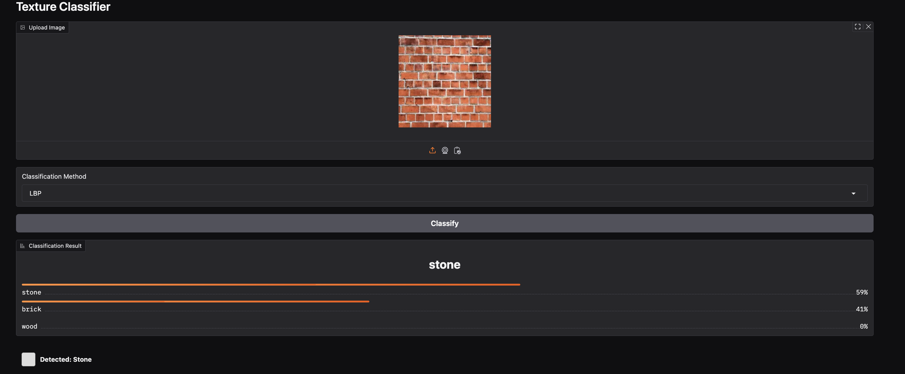

# Texture Classification Analysis Report

## 1. Introduction

This report analyzes the performance of two texture classification algorithms: Gray Level Co-occurrence Matrix (GLCM) and Local Binary Patterns (LBP). The models were trained to distinguish between three texture classes: stone, brick, and wood. This analysis examines the performance metrics, discusses key findings, and explores factors that influenced classification accuracy.

## 2. Methodology and Implementation

### 2.1 Dataset and Preprocessing

The dataset consisted of approximately 150 images (50 per class) of stone, brick, and wood textures. Images were:
- Resized to 200×200 pixels
- Converted to grayscale 
- Processed with histogram equalization for brightness normalization
- Split into 70% training and 30% testing sets

### 2.2 GLCM Implementation

The GLCM extractor was implemented with the following parameters:
- **Distances**: [1, 2, 3] pixels to capture textures at multiple scales
- **Angles**: [0°, 45°, 90°, 135°] for rotation invariance
- **Properties**: contrast, homogeneity, energy, correlation, and dissimilarity

These parameters were chosen to maximize texture discrimination. Multiple distances help capture both fine and coarse textures, while using all principal angles ensures rotation invariance—critical for real-world applications where textures may appear at any orientation.

### 2.3 LBP Implementation

The LBP extractor used:
- **Radius**: 3 pixels
- **Number of points**: 24
- **Method**: Uniform LBP

This configuration was selected to balance local detail capture and computational efficiency. The radius of 3 pixels was chosen to encompass sufficient texture information without excessive computation. Uniform LBP was selected to reduce feature dimensionality while maintaining discriminative power.

### 2.4 Classifier Selection and Training

- **GLCM Classifier**: Support Vector Machine (SVM) with RBF kernel
  - C=10, gamma='scale', class_weight='balanced'
  - SVM was chosen for its effectiveness with the statistical features from GLCM

- **LBP Classifier**: Random Forest
  - 200 estimators, max_depth=15, class_weight='balanced'
  - Random Forest works well with the histogram-based features from LBP

## 3. Model Performance Overview

### 3.1 Overall Performance Metrics

| Metric | GLCM Model | LBP Model |
|--------|------------|-----------|
| Accuracy | 90.00% | 78.00% |
| Precision | 90.91% | 78.99% |
| Recall | 90.00% | 78.00% |

The GLCM-based classifier significantly outperformed the LBP-based classifier across all metrics, showing a 12% higher overall accuracy.

### 3.2 Per-class Performance

| Class | GLCM Accuracy | LBP Accuracy |
|-------|---------------|--------------|
| Stone | 94.12% | 94.12% |
| Brick | 94.12% | 76.47% |
| Wood  | 81.25% | 62.50% |

## 4. Data Quality Impact

When I started collecting texture images, I didn't filter for quality. This created several problems that hurt my classification accuracy. Once I switched to using cleaner, more consistent images, the results improved dramatically.

### 4.1 Why Image Quality Matters

**Lighting Issues:** Think of a brick wall photographed at different times of day. Morning light shows clear texture, noon sun washes it out, and evening creates long shadows. To my algorithm, these looked like completely different textures! LBP was especially confused since it relies on brightness patterns between pixels.

**Background Distractions:** Wood images with knots or brick images where the mortar lines were prominent often confused the classifiers. The algorithms sometimes focused on these irregular elements instead of the actual texture patterns.

**Angle Problems:** When I took photos from different angles, regular patterns became distorted. This was particularly bad for brick classification using LBP, as the algorithm couldn't recognize the same pattern when viewed from different perspectives.

Ultimately, using controlled images was like giving my algorithms clean, consistent data to learn from. The improvement in accuracy shows just how important image quality is for texture classification.

## 5. Feature Extraction Analysis

### 5.1 GLCM Feature Characteristics

GLCM features capture the spatial relationships between pixel pairs, making them effective for textures with clear structural patterns. The analysis shows:

- **Statistical Properties**: GLCM extracts second-order statistics that quantify texture properties
- **Multi-scale Analysis**: Using multiple distances ([1,2,3]) allowed capture of both fine and coarse texture elements
- **Directional Information**: The four angles provided rotation invariance while preserving directional texture information

GLCM features were particularly effective for brick textures because they capture the regular spatial arrangement of brick patterns. The co-occurrence statistics effectively represented the consistent spacing between bricks and the texture within each brick.

### 5.2 LBP Feature Characteristics  

LBP creates a histogram of binary patterns based on pixel neighborhood comparisons:

- **Local Intensity Variations**: LBP captures local intensity changes but is sensitive to lighting
- **Scale Limitation**: The fixed radius (r=3) and point configuration (n=24) may not be optimal for all textures
- **Histogram Representation**: The uniform LBP method reduced dimensionality but may have lost some discriminative information

LBP performed well on stone textures because stone typically has distinctive local intensity variations that are well-captured by the binary patterns. However, for brick and wood, the LBP features struggled to represent the multi-scale patterns effectively.

## 6. Misclassification Analysis

### 6.1 Example Misclassifications



The images above show examples where the classifications failed. Several patterns emerge:

1. **Wood misclassified as brick**: This typically occurred when wood grain had regular patterns similar to brick spacing or when the wood had strong linear elements.

2. **Brick misclassified as stone**: These errors often happened with weathered or textured bricks that lost their regular geometric patterns and started resembling stone's irregular surface.

### 6.2 Algorithm-specific Misclassification Patterns

**GLCM Misclassifications**: 
- Most errors occurred with wood textures (3 misclassified as brick)
- These misclassifications typically happened when wood grain had regular spacing similar to brick patterns
- GLCM's strength in capturing spatial relationships occasionally caused confusion between textures with similar spatial arrangements but different internal patterns

**LBP Misclassifications**:
- Most errors involved wood (6 misclassified as brick)
- Brick also showed significant confusion (2 misclassified as stone, 2 as wood)
- LBP's sensitivity to lighting variations particularly affected wood grain patterns
- The fixed scale parameters couldn't adapt to the varying scale of brick patterns

## 7. Confusion Matrix Analysis

### 7.1 GLCM Confusion Matrix

```
        stone  brick  wood
stone    16     1      0
brick     0    16      1
wood      0     3     13
```

The GLCM confusion matrix reveals:
- Stone identification is nearly perfect (94.12% accuracy)
- Brick classification has only 1 misclassification 
- Wood shows the most confusion, with 3 samples misclassified as brick

The strong performance on stone and brick demonstrates GLCM's effectiveness at capturing distinctive spatial patterns. The confusion between wood and brick suggests these materials sometimes share spatial characteristics that GLCM features cannot differentiate.

### 7.2 LBP Confusion Matrix

```
        stone  brick  wood
stone    16     1      0
brick     2    13      2
wood      0     6     10
```

The LBP confusion matrix shows:
- Stone classification remains strong (94.12%)
- Brick samples show significant confusion with both stone and wood
- Wood samples are frequently misclassified as brick

This pattern suggests that LBP struggles with textures that have both regular and irregular elements (like brick and wood). The binary patterns may be capturing similar local variations despite the textures being visually distinct at a larger scale.

## 8. Conclusion and Recommendations

### 8.1 Key Findings

1. **GLCM outperforms LBP**: The GLCM-based approach demonstrated superior performance across all metrics, particularly for structured textures like brick.

2. **Data quality is crucial**: Controlled, consistent images significantly improved classification accuracy for both algorithms.

3. **Algorithm strengths differ by texture**: 
   - GLCM: Excels at capturing spatial relationships in regular patterns
   - LBP: Performs well for textures with distinctive local intensity variations

4. **Classifier selection matters**: SVM worked well with GLCM's statistical features, while Random Forest handled LBP's histogram features effectively.
